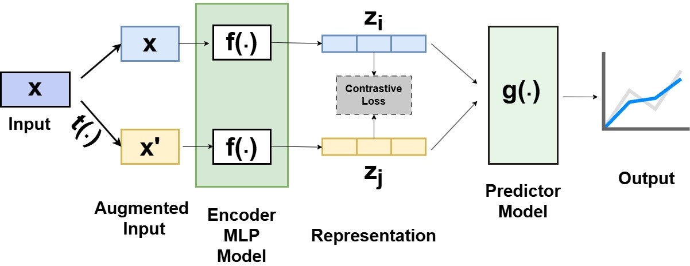

# Contrastive Representation Learning for Aerodynamics Data Prediction
This is the implementation of the paper [Contrastive Representation Learning for Regression-based Aerodynamics Problem: Fuselage and Airfoil](https://arc.aiaa.org/doi/10.2514/6.2025-0477).
Here, we leveraged Regression-based Contrastive Representation Learning method to predict drag and lift coefficients. 
At first, we applied this on Fuselage data that was generated by our work as well.
Then we extended our model's application to the airfoil (NACA) dataset to demonstrate the robustness of our method.
We hope this will motivate practitioners from Aerospace to adopt our proposed CRL method.

<div align="center">

</div>


## Dataset Preparation
Convert your dataset into a csv format, and keep a column with `split` for train, validation and test set. 
We would also recommend to normalize your data before using it for the model. 
The `dataset.py` file will handle the dataset. Depending on your input file path, you might have to change the CSV file path.

## Training

### Phase 1
In this phase, **train the encoder model by running `main_smk_rnc.py`.** 

Remember to parse the right values, especially for `data_folder`, `dataset`, and hyperparameters like `epochs`, `learning_rate`, `batch_size`, etc. If you use a different dataset, you might have to change the `encoder_input_size` depending on your data dimension.

After running this file, it will save the trained model in a folder named `save`. 
We used 2 different MLP models as the encoder for our use cases. You can write your own encoder instead of using ours from `my_mlp.py`. 


### Phase 2
In this phase, **train the predictor model by running `main_linear.py`.** 

Remember to pass the path of the saved encoder model from Phase 1 through the `ckpt` argument. 

We used a linear regressor as the predictor. This trained predictor will be saved in the same folder as Phase 1.


## Testing
To evaluate the model, use the script `test.py`. It will generate MAE and average accuracy.

## Citation
Please cite our work if you use our method, or any part of this codebase in your work.

```bibtex

@inbook{doi:10.2514/6.2025-0477,
author = {Tasfia Maysa Binte Kamal and Shoumik Saha},
title = {Contrastive Representation Learning for Regression-Based Aerodynamics Problem: Fuselage and Airfoil},
booktitle = {AIAA SCITECH 2025 Forum},
chapter = {},
pages = {},
doi = {10.2514/6.2025-0477},
URL = {https://arc.aiaa.org/doi/abs/10.2514/6.2025-0477},
eprint = {https://arc.aiaa.org/doi/pdf/10.2514/6.2025-0477},
abstract = { The field of aerodynamics is often constrained by data scarcity, which limits the development of accurate predictive models due to the time and resource demands of traditional data generation methods. This challenge is particularly pronounced in the emerging domain of electric Vertical Take-Off and Landing (eVTOL) aircraft, where diverse configurations—spanning over 1,000 unique designs—complicate aerodynamic modeling. While Computational Fluid Dynamics (CFD) and wind tunnel testing are accurate, their scalability is limited, and machine learning approaches are hindered by the lack of extensive labeled datasets. To address these challenges, this study employs contrastive representation learning, a self-supervised technique that learns robust features from relationships between similar and dissimilar data. By generating diverse eVTOL fuselage and airfoil datasets through systematic shape parameterization and validating results via CFD, the proposed framework delivers scalable and accurate aerodynamic predictions. This tailored application of contrastive learning offers a practical and efficient alternative to traditional methods, addressing both design diversity and data scarcity in aerodynamic modeling. }
}
```
